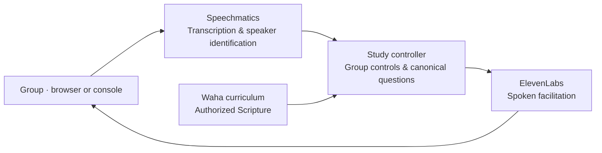

# Multilingual Group Discovery Bible Study Facilitator

**Discover Scripture together, in your group's language.**

A Waha-inspired system for group Discovery Bible Study and a **Gloo Hackathon**
project. Gather around one microphone, choose a study language, and
work through the passage together. The facilitator guides the questions and
keeps the session moving at the group's pace.

The heart of the app is discovery: read Scripture, listen to each other, and
put what you discover into practice. Canonical Waha questions shape the study;
the group brings the conversation.

## The app

The browser app brings Waha's visual style and study flow to a shared voice
session. English and Spanish are the supported study languages.

| Capability | Implementation |
| --- | --- |
| Group introductions | Names and thankfulness, with each person confirming their own name |
| Speaker recognition | Speechmatics transcription, diarization, and session-only voice identifiers |
| Study flow | Canonical Waha questions and Genesis 1:1–25 |
| Spoken facilitation | ElevenLabs Flash v2.5 in English and Spanish |
| Group controls | Confirm, advance, repeat, read the passage, pause, resume, and stop |
| Browser experience | Microphone controls, roster, current question, transcript, and session diagnostics |
| Text rehearsal | Practice the same study flow without a microphone or voice enrollment |

The default DBS flow uses deterministic controls. Questions about the passage
are redirected to Scripture and the group; the facilitator does not generate
Bible answers. The CLI provides additional language configurations, with the
requirements described below.

## Architecture

The voice pipeline connects speech recognition to the study controller, exact
curriculum assets, and spoken output. The controller manages introductions,
roster confirmation, study progression, and playback controls.



## Run the application

### Prerequisites

- **Python 3.13**; the pinned dependencies were verified with Python 3.13.5.
- **Speechmatics** and **ElevenLabs** API keys for voice sessions.
- A local **Waha app checkout** containing canonical curriculum data under
  `shared/data`. English also needs its NLT Bible cache or an authorized
  `SCRIPTURE_FILE`. These runtime assets are not bundled with this repository.
- **PortAudio** for console microphone use. The browser captures its own audio.

Clone and install:

```bash
git clone https://github.com/theJoshMuller/multilingual-dbs-facilitator.git
cd multilingual-dbs-facilitator

python3.13 -m venv .venv
.venv/bin/python -m pip install -r requirements.txt
```

Create a local `.env` file:

```dotenv
SPEECHMATICS_API_KEY=your-speechmatics-key
ELEVENLABS_API_KEY=your-elevenlabs-key
WAHA_ROOT=/absolute/path/to/waha-app
DBS_LLM_PROVIDER=rules
```

The app loads `.env.local` and `.env`; both are ignored by Git. Without
`WAHA_ROOT`, it looks for a sibling `../waha-app` directory.

Start the server:

```bash
.venv/bin/python dbs_web.py
```

Open [localhost:8094/dbs/](http://localhost:8094/dbs/), select English or Spanish,
confirm that everyone agrees to the voice session, and start together.
Use headphones or a tested echo-cancelling speakerphone, speak one person at a
time, and keep the page in the foreground on a phone.

The browser sends microphone audio over a WebSocket to the existing study
controller. This transport runs without a LiveKit room server or LiveKit Cloud.
For access from another device, serve it over HTTPS and allow the exact public
origin through `DBS_WEB_ORIGINS`. The Python server binds to loopback.

### Console voice sessions

Install PortAudio first if needed; on Debian/Ubuntu:

```bash
sudo apt install portaudio19-dev python3-dev
```

Then download the local VAD assets and choose a language:

```bash
.venv/bin/python dbs_agent.py download-files

# English: canonical Waha questions and Genesis 1:1–25, NLT.
.venv/bin/python dbs_agent.py console --log-level info

# Spanish: canonical Waha questions, with participant-read NVI by default.
DBS_LANGUAGE=es .venv/bin/python dbs_agent.py console --log-level info
```

Stop with **Ctrl-C**. English and Spanish rules mode requires no model API key.

### Text rehearsal

Practice introductions and study controls without microphone access, voice
enrollment, or speech-provider calls:

```bash
.venv/bin/python dbs_agent.py rehearse
DBS_LANGUAGE=es .venv/bin/python dbs_agent.py rehearse
```

Text rehearsal still requires the canonical lesson assets. Use **Ctrl-D** to exit.

## A session together

1. Each person says their name and something they are thankful for since the
   last meeting. For example: “My name is Josh, and I'm thankful for …” or
   “Me llamo Kami y estoy agradecida por …”.
2. That same person confirms their own name with “Yes” or “Sí”. Voice enrollment
   needs a real Speechmatics identifier and at least five seconds of recognized
   speech; about 20 seconds per introduction works well.
3. Once everyone has shared, finish introductions and confirm the group roster.
   Mentioned friends do not count as participants.
4. Read the passage and discuss each question together. The facilitator stays
   quiet during ordinary discussion.
5. Ask to advance when the group is ready, then confirm. Silence does not
   advance the lesson.

Use **`William` as the voice command prefix**. Prefix the commands below with
“William,”; confirmations use “Yes” / “No” or “Sí” / “No”.

| Action | English | Spanish |
| --- | --- | --- |
| Finish introductions | everyone is here | ya estamos todos |
| Advance | next question | siguiente pregunta |
| Repeat | repeat | repite |
| Read the passage | read the passage again | lee el pasaje otra vez |
| Pause | pause | pausa |
| Resume | resume | continúa |
| End | stop | detente |

For example: “William, next question” or “William, siguiente pregunta”.
The browser also provides buttons for session controls.

## Languages and Scripture

| Study language | Availability | Passage |
| --- | --- | --- |
| English | Tested controls and UI; available in browser and CLI | Genesis 1:1–25, NLT, from the canonical cache or an authorized file |
| Spanish | Tested controls and UI; available in browser and CLI | Genesis 1:1–25, NVI; a participant reads unless an authorized file is supplied |
| Other languages | CLI configuration available; requires integration validation | Requires matching canonical questions, Scripture, and speech support |

### Canonical Waha content

Lesson `01.001.001` uses Waha's questions `f.001`, `f.002`, `f.003`, `f.008`,
and `a.001` through `a.007`. The introductions combine names and
thankfulness in place of the spoken `f.001` welcome; the remaining questions
are exact Waha spoken-question strings.

The extracted reference is in
[research/canonical-01.001.001.json](research/canonical-01.001.001.json).
[Facilitation research](research/dmc-facilitation-evidence.md) records the
source guidance. Curriculum and Scripture are read from source assets, never
reconstructed or translated by a model.

### Spanish NVI

Spanish uses **NVI**. When an authorized local NVI passage is unavailable, the
facilitator asks a participant to read and waits before the retelling question.

To enable spoken NVI reading, set `SCRIPTURE_FILE` to an authorized UTF-8 JSON
file with:

- `bibleTextId: "NVI"` and `languageId: "spa"`.
- `verses`: exactly 25 objects, ordered from `GEN.1.1` through `GEN.1.25`,
  each containing `verseId` and nonempty `text`.
- An optional `copyright` string for attribution.

Incorrect versions, missing verses, and changed ordering are rejected.
Keep private or restricted Bible exports out of the repository.

### Broader language configuration

```bash
.venv/bin/python dbs_agent.py list-languages
```

The captured Speechmatics catalog contains 56 individual language codes and
five combined-language packs. This is recognition coverage, not a claim that
all of those languages have a working study experience.

The CLI can select recognition with `STT_LANGUAGE` independently of the
facilitation locale `DBS_LANGUAGE`. Realtime enrollment does not use batch
`auto` or `multi` modes; provider account entitlements still apply.

An additional locale needs canonical Waha spoken questions, matching Scripture,
ElevenLabs Flash v2.5 speech support, and a model parser configured
with `DBS_LLM_PROVIDER=ollama` or `openrouter`. Flash's configured language set
contains 32 languages. Missing assets or unsupported speech output fail at
startup.

Optional model parsers return validated `{intent, name}` objects. A reviewed
`DBS_PROMPTS_FILE` can supply localized UI copy with the keys and placeholders
from `dbs_prompts.EN`; otherwise these routes translate interface
copy at startup. They do not translate curriculum or Scripture. Participant
turns are sent to the selected model provider.

The browser currently accepts English and Spanish only. Additional CLI locales
and optional model routes have not been live-validated. Immediate stop/pause
detection is English/Spanish; **Ctrl-C** remains available in the CLI.

## Configuration

| Variable | Purpose |
| --- | --- |
| `WAHA_ROOT` | Waha checkout containing canonical curriculum and Bible assets |
| `DBS_LANGUAGE` | CLI facilitation locale; defaults to `en` |
| `WAHA_LANGUAGE` | Explicit Waha locale when language matching is ambiguous |
| `STT_LANGUAGE` / `STT_DOMAIN` | CLI recognition language and optional domain |
| `SCRIPTURE_FILE` | Authorized, version-matched passage JSON |
| `SPEECHMATICS_API_KEY` | Speech recognition and speaker identification |
| `ELEVENLABS_API_KEY` / `ELEVEN_API_KEY` | Speech synthesis |
| `ELEVENLABS_ENV_FILE` | Read an existing ElevenLabs key file |
| `ELEVENLABS_VOICE_ID` / `ELEVENLABS_VOICE_ID_ES` | Override the default Eric voice globally or for Spanish |
| `DBS_MAX_PEOPLE` / `DBS_MAX_SPEAKERS` | Group size and recognition ceiling; defaults are 7 and 10 |
| `DBS_LLM_PROVIDER` | CLI parser: `rules` by default; optional `ollama` or `openrouter` |
| `DBS_PROMPTS_FILE` | Reviewed localized interface strings |
| `DBS_WEB_PORT` | Browser server port; defaults to `8094` |
| `DBS_WEB_ORIGINS` | Exact browser origins allowed to connect |

Speech synthesis uses `eleven_flash_v2_5` with 16 kHz PCM. Only
`DBS_TTS_PROVIDER=elevenlabs` is supported. The console validates each prompt's
audio before playback; first-byte timing is not time to audible response.

## Session privacy and operating requirements

Get everyone's agreement before opening the microphone. Speechmatics receives
microphone speech for transcription and speaker identification; ElevenLabs
receives spoken text, including names. Normal provider logging applies.
Optional model routes also receive participant turns.

DBS speaker identifiers and roster names are session-only. The DBS flow does
not persist `.speaker_profiles.json` or record local audio. Browser transcripts
and diagnostics stay in page memory; console logs may contain transcripts.
Restart introductions after an STT disconnect because temporary speaker labels
can change.

English and Spanish are the live-tested languages. Room-level speaker accuracy
and echo handling have not been validated in a human group trial. Rules mode
expects explicit commands. Stop/pause preemption follows finalized recognition rather
than happening instantly. Resuming an interrupted console reading replays its
prompt batch. The limited danger-phrase handling is not emergency monitoring.

## Development

Run the local regression suite and lint checks:

```bash
.venv/bin/python -m unittest -v
uvx ruff check dbs_*.py test_dbs*.py smoke_dbs.py
```

Optional voice smoke checks make real speech-provider calls using synthesized
test speech:

```bash
.venv/bin/python smoke_dbs.py --language en
.venv/bin/python smoke_dbs.py --language es
```

Those checks exercise real voice identification and controller confirmations.
They do not establish multi-person recognition accuracy or acoustic interruption
accuracy in a room.

| File | Responsibility |
| --- | --- |
| [dbs_web.py](dbs_web.py) | Browser WebSocket transport and session controls |
| [web/](web/) | Waha-inspired browser interface |
| [dbs_agent.py](dbs_agent.py) | Console runtime and shared study controller |
| [dbs_flow.py](dbs_flow.py) | Study phases, confirmations, and roster |
| [dbs_curriculum.py](dbs_curriculum.py) | Canonical questions and validated Scripture |
| [dbs_intents.py](dbs_intents.py) | Deterministic and optional model-assisted controls |
| [dbs_prompts.py](dbs_prompts.py) | English and Spanish interface copy |
| [dbs_tts.py](dbs_tts.py) | ElevenLabs speech synthesis |
| [ops/dbs-web.service](ops/dbs-web.service) | Example systemd service; adjust local paths and origins |

The legacy general-purpose `agent.py` runtime has its own
[legacy setup guide](docs/legacy-voice-agent.md).
