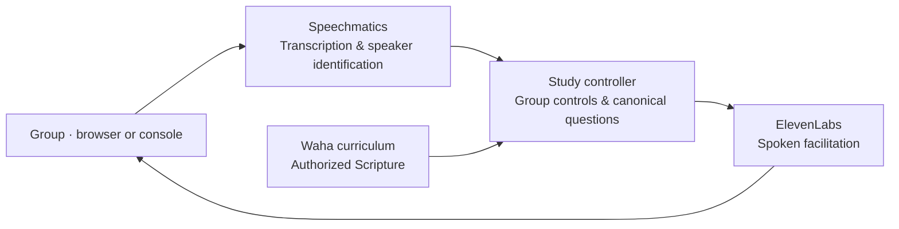

# Multilingual Group Discovery Bible Study Facilitator

**Discover Scripture together, in your group's language.**

William guides a small group around one microphone through Waha's fellowship,
Scripture, discovery, and application questions. This Gloo Hackathon prototype
now combines AssemblyAI recognition, conversational facilitation, ElevenLabs
v4 Turbo/Mark, and official YouVersion NIV in its default English browser mode.
The original English/Spanish Speechmatics mode remains selectable. Mixed-language
participant translation is still pending; the EN/TR proof tests recognition only.

The default is **generative facilitation**: William generates brief procedural
speech and understands natural requests. The server owns exact canonical
questions, Scripture playback, identity evidence, and study position. Ordinary
contributions usually receive silence. See the source-labeled
[illustrative three-person session](SAMPLE_SESSION.md).

## Combined English DBS

This follow-on branch defaults to **English DBS · NIV** on the same browser mic
and private WebSocket bridge. It uses one AssemblyAI Universal-3.6 Pro stream,
ElevenLabs speech, Josh’s requested opening and the remaining original English Waha questions, and official server-side
YouVersion NIV version 111 (New International Version 2011, publisher Biblica).
Source verification happens before the billed stream opens. Each of the 25
Genesis 1:1–25 verses is individually validated; no Waha Bible cache or generated
verse is used by this mode. English participant contributions are not translated.

William uses PR #1's configured **OpenRouter facilitator** by default; this no
longer requires an active Codex session. Configure its existing secure server-side
credential source with `DBS_OPENROUTER_ENV_FILE` and choose `DBS_LLM_MODEL` if needed.
No provider key enters browser JavaScript. Clear introductions are recorded silently,
uncertain names get a brief clarification, and explicit natural readiness advances
the group. One optional nudge follows seven seconds of silence; silence never advances.

The exact Josh-authored welcome plays once automatically without a model call.
All remaining Waha questions and the official NIV passage are read unchanged.
English contributions are never translated. Pause interrupts playback; Resume
preserves the remaining prompts. Voice wake interruption is not enabled for AssemblyAI.
Self-reported names are distinct from cautious same-label voice bindings. Human
name recognition remains **UNVERIFIED**; PENDING, short, overlapping and revised
turns cannot establish identity.

For isolated verification, set `DBS_ENGLISH_FACILITATOR=codex-session` explicitly.
Only that test mode requires the active Codex session and its authenticated
loopback queue. Offline tests inject decisions and make no external model calls.
Arrange participant consent before startup, outside the agent UX.

Keep `ASSEMBLYAI_API_KEY` only in the worktree’s ignored owner-only `.env`. Set
`WAHA_ROOT` and `YVP_SERVER_FILE` to the existing curriculum/API integration. Its
YVP key stays in its own project. Existing ElevenLabs credentials are reused in
place via `ELEVENLABS_ENV_FILE`; no key is copied into JavaScript or publication.
Start `.venv/bin/python -E dbs_web.py` from this worktree. The current local test
combined test address is <http://127.0.0.1:8097/dbs/>. Override the port and
origins together using `DBS_WEB_PORT` and `DBS_WEB_ORIGINS`. See
[English test evidence](docs/assemblyai-english-handoff.md) for limitations.

## AssemblyAI ASR spike

The separate ASR proof remains selectable as **One mic · EN/TR ASR proof**. This mode only
transcribes: William does not speak, enroll names, translate or read Scripture.
One Universal-3.6 Pro provider stream receives the existing 16 kHz mono PCM
microphone feed through the server. Vendor speaker labels and language codes
are shown separately; human names remain unverified.

For this mode, use a secure local editor to add `ASSEMBLYAI_API_KEY` to the
worktree's Git-ignored `.env`, then set owner-only permissions with `chmod 600 .env`.
The key is never supplied to browser JavaScript. No Speechmatics/ElevenLabs key
is needed for this proof. Start `dbs_web.py`, choose the proof mode, and stop
within three minutes; connected time is billed by the provider. Arrange consent
with everyone present before testing. Speech stays in session memory.

The original single-language study remains selectable. Its setup below is the
legacy Waha/Speechmatics path; it does not yet use official YouVersion text.
Optional source-validation groundwork requires `WAHA_ROOT` and
`YVP_SERVER_FILE=/absolute/path/to/youversion_platform/server.py`. Read that
project's `agents.md` before API use; its key stays in that project's `.env`.
See [the spike handoff](docs/assemblyai-spike-handoff.md) for real versus mocked
evidence and the remaining identity, switching and echo checks.

## The app

The browser app brings Waha's visual style and study flow to a shared voice
session. English and Spanish are the supported study languages.

| Capability | Implementation |
| --- | --- |
| Group introductions | Names and thankfulness; clarify uncertain names naturally |
| Recognition | AssemblyAI in the default English mode; Speechmatics in the original mode |
| Study flow | Canonical Waha questions and Genesis 1:1–25 |
| Spoken facilitation | ElevenLabs v4 Turbo with Mark — Natural Conversations |
| Group controls | Previous, next, repeat, read the passage, pause, resume, and stop |
| Browser experience | Microphone controls, roster, current question, transcript, and session diagnostics |
| Text rehearsal | Practice the same study flow without a microphone or voice enrollment |

Generative facilitation is the default; explicit rules mode retains deterministic controls. Questions about the passage
are redirected to Scripture and the group; the facilitator does not generate
Bible answers. The CLI provides additional language configurations, with the
requirements described below.

## Architecture

The voice pipeline connects speech recognition to the study controller, exact
curriculum assets, and spoken output. The controller manages introductions,
roster confirmation, study progression, and playback controls.



## Run the application

### Prerequisites

- **Python 3.13**; the pinned dependencies were verified with Python 3.13.5.
- **Speechmatics** and **ElevenLabs** API keys for voice sessions.
- A local **Waha app checkout** containing canonical curriculum data under
  `shared/data`. English also needs its NLT Bible cache or an authorized
  `SCRIPTURE_FILE`. These runtime assets are not bundled with this repository.
- **PortAudio** for console microphone use. The browser captures its own audio.

Clone and install:

```bash
git clone https://github.com/theJoshMuller/multilingual-dbs-facilitator.git
cd multilingual-dbs-facilitator
python3.13 -m venv .venv
.venv/bin/python -m pip install -r requirements.txt
```

Create an ignored local `.env` with your own credentials:

```dotenv
WAHA_ROOT=/absolute/path/to/waha-app
SPEECHMATICS_API_KEY=your-speechmatics-key
ELEVENLABS_API_KEY=your-elevenlabs-key
OPENROUTER_API_KEY=your-openrouter-key
DBS_FACILITATION_MODE=generative
DBS_LLM_MODEL=google/gemini-3.1-flash-lite
```

The application loads `.env.local` and `.env`. `WAHA_ROOT` defaults to the sibling
`../waha-app`. Generative mode uses OpenRouter and fails explicitly on missing
configuration or provider errors; it does not silently switch to scripted prose.
The key can also come from the environment or a static literal assignment in
`DBS_OPENROUTER_ENV_FILE` (default `~/.config/shell/profile`); that file is parsed,
never executed. Keep credentials out of source control and browser JavaScript.

```bash
# Browser
.venv/bin/python dbs_web.py

For the legacy mode, open [localhost:8094/dbs/](http://localhost:8094/dbs/) and
select English or Spanish. Arrange everyone's consent before startup, outside
the app, then start together.
Use headphones or a tested echo-cancelling speakerphone, speak one person at a
time, and keep the page in the foreground on a phone.

The browser sends microphone audio over a WebSocket to the existing study
controller. This transport runs without a LiveKit room server or LiveKit Cloud.
For access from another device, serve it over HTTPS and allow the exact public
origin through `DBS_WEB_ORIGINS`. The Python server binds to loopback.

### Console voice sessions

Install PortAudio first if needed; on Debian/Ubuntu:

```bash
sudo apt install portaudio19-dev python3-dev
```

Then download the local VAD assets and choose a language:

```bash
.venv/bin/python dbs_agent.py download-files
.venv/bin/python dbs_agent.py console --log-level info
DBS_LANGUAGE=es .venv/bin/python dbs_agent.py console --log-level info

# Text rehearsal: no microphone, speech recognition, or speech synthesis
.venv/bin/python dbs_agent.py rehearse
DBS_LANGUAGE=es .venv/bin/python dbs_agent.py rehearse
```

Text rehearsal still uses the configured model in generative mode and requires
canonical assets. Exit with Ctrl-D; console voice sessions stop with Ctrl-C.
To use the deterministic fallback explicitly, set
`DBS_FACILITATION_MODE=rules DBS_LLM_PROVIDER=rules`. That combination needs no
model credential. `DBS_LLM_PROVIDER` retains its separate optional intent-parser
meaning in rules mode; it does not select the generative facilitator.

Open [localhost:8094/dbs/](http://localhost:8094/dbs/) and select English or Spanish.
The human organizer obtains everyone's consent **before startup, outside the
application**. The agent UX has no consent checkbox or dialogue gate. Browser microphone
permission is separate. Provider disclosures remain visible before startup.

Use headphones or a tested echo-cancelling speakerphone and speak one person at a
time. Keep the page in the foreground on a phone. The browser uses WebSocket
audio directly, without a LiveKit room server. For another device, use HTTPS and
allow the exact origin through `DBS_WEB_ORIGINS`; the server binds to loopback.

## How a session works

The generated opening is prompted to invite everyone to share their name and thankfulness in one
contribution, then tell William when everyone has spoken and the group is ready for
the next question. A clear self-introduction registers the person immediately;
there is no compulsory per-person name confirmation. Successful introductions are
silent: the server suppresses any generated acknowledgement or immediate invitation,
so the next person can speak. Only the seven-second silence event requests a nudge.
Uncertain names use a brief
clarification that only the same solo speaker can confirm or correct. A diarization
label alone cannot bind a name: voice registration still requires usable opaque
recognition evidence from sufficiently long introductions (at least five seconds).
An explicit self-correction of a registered name requires matching voice evidence.
Text rehearsal deliberately bypasses voice enrollment and creates no voice profile.

The LLM interprets readiness from the current turn and conversation history:
a clear request to begin or continue can select `finish_enrollment`, including a
natural reply to William's readiness invitation. Participants do not need to state
that everyone has shared or use particular words. The server then advances to the
next canonical question. If the final person introduces themselves and gives that signal in the same contribution,
the decision can include their own name so they are recorded before advancing.
Silence, speaker count, or a list of other people's names does not authorize
continuing or establish attendance. A participant's readiness request authorizes
continuing with the registered group; it does not prove that everyone has shared.
Unresolved name clarification blocks completion.

Ask William directly to move on, go back, repeat the question, read the passage,
pause, resume, or stop. In generative mode “William, let's move on” advances
without a separate yes gate. Buttons execute known controls without a model
request. Rules mode retains its explicit commands and confirmation behavior.
In generative mode, about seven seconds of silence requests one brief generated
nudge during introductions or the study. It does not repeat until new participant
input or a navigation/resume control starts another lull. Pause, active speech,
queued input and playback suppress the timer; stale queued nudges are discarded.
The spoken nudge also needs model and TTS time. Rules mode keeps its 25-second
timer. Silence never advances the lesson. William answers group/procedure questions, while Bible-content
questions are directed back to the complete current source question.

Browser audio is half duplex: microphone input is suppressed during William's
playback. **Use the Pause button during speech. Voice wake interruption during
browser playback is not implemented.** Resume replays interrupted browser
prompts; console resume replays its interrupted batch. Previous changes the
study position directly. The final closing remains interruptible until playback
succeeds and is acknowledged; provider or playback failure does not complete it.

## Source content and languages

Lesson `01.001.001` uses `f.001`, `f.002`, `f.003`, `f.008`, Genesis 1:1–25, and
`a.001` through `a.007`. The generated opening covers names and thankfulness in
place of speaking `f.001`; subsequent canonical questions play verbatim.
[The extracted reference](research/canonical-01.001.001.json) records the exact
questions, passage, and provenance. [Facilitation research](research/dmc-facilitation-evidence.md)
records the source guidance.

English reads NLT from the local Waha cache or an authorized matching file.
Spanish uses NVI: without an authorized local passage, William asks a participant
to read and waits for explicit continuation before retelling. No model supplies,
reconstructs, or translates Scripture. The current loader uses local assets;
its existence is not evidence of YouVersion API integration.

`SCRIPTURE_FILE` is UTF-8 JSON containing `bibleTextId`, `languageId`, and `verses`:
exactly 25 ordered objects from `GEN.1.1` through `GEN.1.25`, each with `verseId`
and nonempty `text`. Spanish requires `NVI` / `spa`; an optional `copyright`
provides attribution. Mismatched editions and incomplete passages are rejected.
Keep restricted exports private.

The browser and generative facilitator support `en` and `es`. Other CLI language
configurations remain rules-mode experiments requiring matching curriculum,
Scripture, interface copy, recognition, and speech output. Provider catalogs do
not establish working group language combinations. `list-languages` lists the
recognition configuration; it is not a mixed-language feature.

## Configuration and engine roles

| Setting | Purpose |
| --- | --- |
| `DBS_ENGLISH_FACILITATOR` | `configured` by default; `codex-session` for isolated native verification |
| `ASSEMBLYAI_API_KEY` / `YVP_SERVER_FILE` | Worktree-only recognition key and read-in-place YouVersion integration path |
| `DBS_OPENROUTER_ENV_FILE` | Existing secure server-side model credential source; never copy keys into JS |
| `DBS_FACILITATION_MODE` | `generative` by default; explicit `rules` fallback |
| `OPENROUTER_API_KEY` / `DBS_LLM_MODEL` | Generative model credentials and model selection |
| `DBS_LLM_PROVIDER` | Rules-mode intent parser: `rules`, optionally `ollama` or `openrouter` |
| `DBS_LANGUAGE` / `WAHA_LANGUAGE` | CLI locale and explicit Waha locale |
| `STT_LANGUAGE` / `STT_DOMAIN` | CLI recognition language and optional domain |
| `WAHA_ROOT` / `SCRIPTURE_FILE` | Canonical curriculum and authorized passage |
| `DBS_MAX_PEOPLE` / `DBS_MAX_SPEAKERS` | Participant and recognition ceilings; defaults 7 / 10 |
| `ELEVENLABS_VOICE_ID` / `ELEVENLABS_VOICE_ID_ES` | Override the default Mark voice globally or for Spanish |
| `ELEVENLABS_ENV_FILE` / `ELEVEN_API_KEY` | Alternative ElevenLabs credential sources |
| `DBS_WEB_PORT` / `DBS_WEB_ORIGINS` | Port (default 8094) and exact allowed origins |

AssemblyAI supplies revisable labels and language codes in the English mode.
Speechmatics supplies opaque voice evidence only in the original mode.
ElevenLabs reads generated text unchanged and canonical text from the server.

Speech synthesis defaults to `eleven_v4_turbo` and Mark — Natural Conversations
(`UgBBYS2sOqTuMpoF3BR0`) using HTTP Text-to-Dialogue streaming and 16 kHz PCM.
Long text is sent in source-preserving requests of at most 2,000 characters;
there is no alternate-model fallback. Only `DBS_TTS_PROVIDER=elevenlabs` is
supported. The console validates each prompt's complete audio before playback;
first-byte timing is not time to audible response. Josh approved real paired
English/Spanish/Turkish output samples; that is not a human-group ASR or
end-to-end study validation. Retained Flash language reports describe the earlier
baseline, not the current default or a newly qualified support list.

| File | Responsibility |
| --- | --- |
| [dbs_controller.py](dbs_controller.py) | Shared start/idle/accept/control, rendering, history, snapshots, completion acknowledgment, cleanup |
| [dbs_facilitator.py](dbs_facilitator.py) | Bounded OpenRouter requests and strict Decision validation |
| [dbs_conversation.py](dbs_conversation.py) | Generative flow's identity checks, navigation, manual passage gate |
| [dbs_flow.py](dbs_flow.py) / [dbs_intents.py](dbs_intents.py) | Deterministic fallback flow and intent parsing |
| [dbs_curriculum.py](dbs_curriculum.py) | Exact Waha questions and validated local Scripture |
| [dbs_agent.py](dbs_agent.py) / [dbs_web.py](dbs_web.py) | Console/text and browser recognition/playback adapters |
| [dbs_tts.py](dbs_tts.py) / [web/](web/) | ElevenLabs output and browser interface |

The controller has no recognition/runtime imports. Async decisions serialize;
local controls invalidate pending work immediately. Snapshots restore flow and
history together. Runtimes call `complete_playback(prompts)` only after successful
output, and `close()` clears session state and closes the facilitator client.

## Privacy and evidence

Speechmatics receives microphone speech; OpenRouter receives participant turns,
registered names, pending identity, study context, and the latest 16 user/assistant
history entries; ElevenLabs receives spoken text, including names. Normal provider policies
apply. Model context is bounded, not confidential from the provider.

The roster, opaque voice identifiers, and bounded controller history are
session-only and cleared on stop/close. The flow does not persist voice profiles
or record local audio. Browser transcript/diagnostic state stays in page memory;
console logging may contain transcripts. Restart introductions after recognition
disconnects because temporary labels can change.

Facilitation instructions tell the model to avoid theological answers, routine
praise, and judgments about interpretations. Strict schema checks, exact source
playback, and evidence checks constrain actions and grounding claims; **they do
not prove that every generated sentence respects those semantic instructions**.
The sample and unit tests use injected decisions/mock transports, not a real
model transcript or a consenting human-group trial. Room speaker accuracy, echo,
and end-to-end latency still need real group validation. Limited danger handling
is not emergency monitoring.

## Development

```bash
.venv/bin/python -m unittest -v
uvx ruff check dbs_*.py test_dbs*.py smoke_dbs.py
node --test tests/test_dbs_client.cjs
node --check web/app.js
```

The regression suite is offline. `smoke_dbs.py --language en` (or `es`) is a
separate integration check that makes real speech-provider calls; it cannot
establish human-group recognition accuracy. The legacy general-purpose runtime
has a separate [setup guide](docs/legacy-voice-agent.md).
